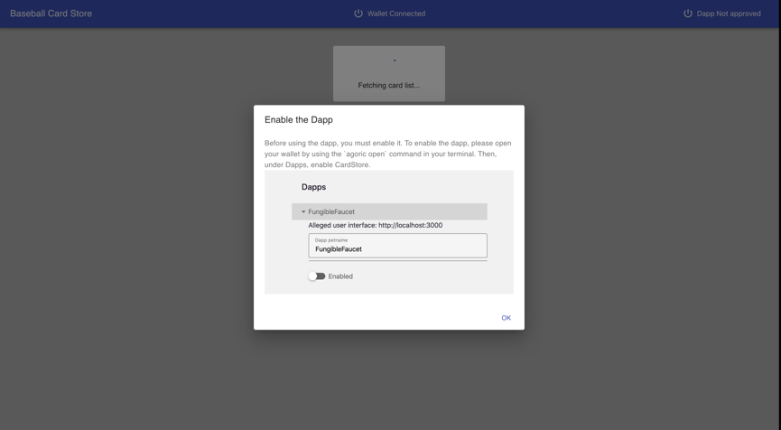
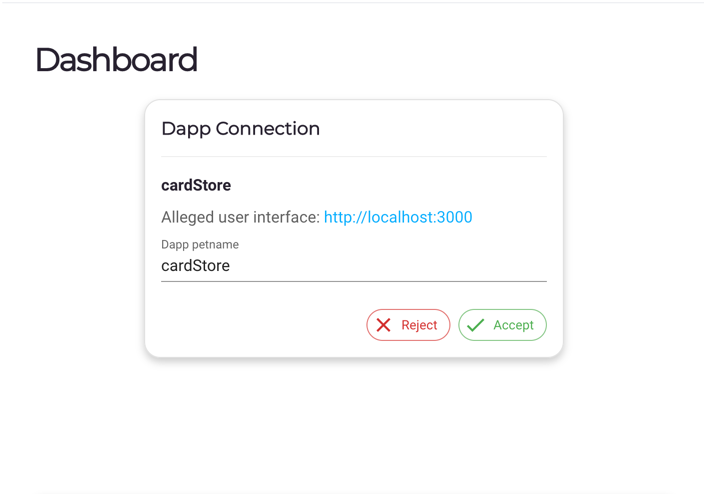

# Agoric Bootcamp Assignment 1 - Baseball Card Store Dapp

Make sure you've install the
[prerequisites](https://agoric.com/documentation/getting-started/before-using-agoric.html).

## Running The Dapp

### Terminal 1

```sh
## If you haven't installed the agoric-sdk already
cd agoric-sdk
git checkout 65d3f14c8102993168d2568eed5e6acbcba0c48a
yarn && yarn build
yarn link-cli ~/bin/agoric
```

### Terminal 2

```sh
## Install the Dapp
git clone _PATH_TO_YOUR_REPO_CREATED_FROM_THE_TEMPLATE_
cd agoric-week-1
agoric install

## Start simulated blockchain
agoric start --reset --verbose 
```
### Terminal 3

```sh
cd agoric-week-1

## Deploy the contract
agoric deploy contract/deploy.js api/deploy.js

## Open Wallet UI
agoric open --repl 
```

### Terminal 4

Make sure to execute below commands after the commands in `Termianl 3` are finished executing.

```sh
## Start Dapp UI
cd agoric-week-1/ui
yarn start
```

## Using The Dapp
Our sample dapp demonstrates an auction for baseball cards. Users will place their bids on the cards they want
and after the bid duration ends the highest bidding user will receive the baseball card in their wallet. The bid
duration is 5 mins.

1. Open http://localhost:3000 from your browser. You should see something like below:

  

2. Then go to the page automatically opened when you execute `agoric open --repl` command. Approve the dapp from the
dashboard.

   

3. Once the approval is successful you should see the list of baseball cards available.
4. Click on one of the cards and place your bid.
5. Go to your wallet UI and approve the offer.
6. Wait for 5 mins then see your baseball card in your `cardStore.Card` purse.
